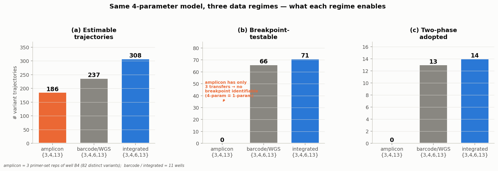
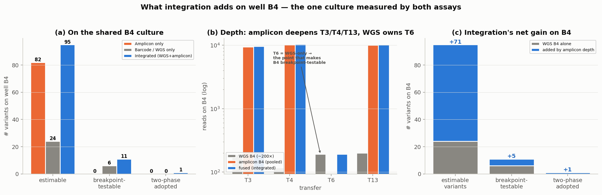
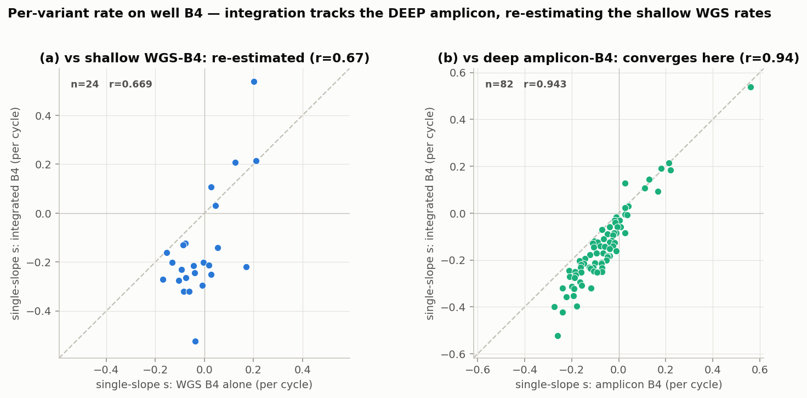
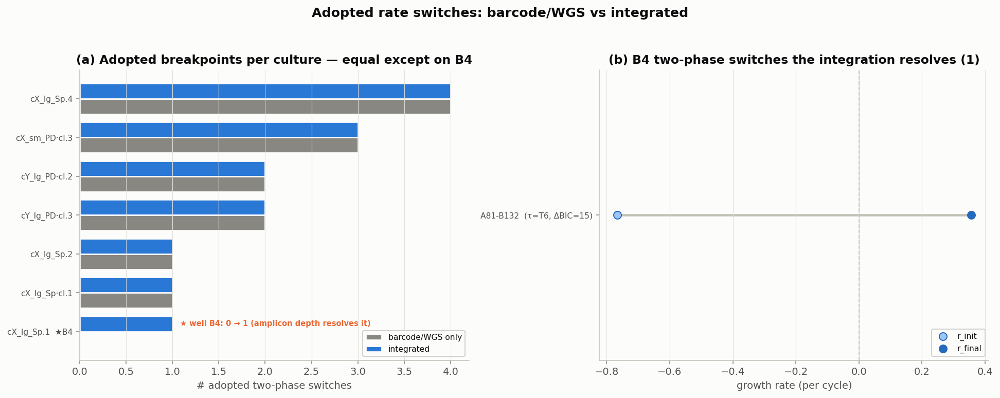

# 4-Parameter Growth Model — Three-Way Comparison

*The same four-parameter segmented (two-phase / broken-stick) growth model, applied to
three data regimes drawn from the TFMN4 barcode-competition experiment. Every number below
is computed from the three models' own outputs (this folder's `inputs/`), not re-fit here.*

The four parameters per variant trajectory are **initial abundance**, **initial growth
rate**, **final growth rate**, and the **transfer at which the rate switches** (increasing
switches only, adopted only on strong evidence: ΔBIC > 6 **and** a > 10 % rate increase).

---

## 1. Headline

| Data regime | Transfers | Estimable | Breakpoint-testable | Two-phase adopted |
|---|--:|--:|--:|--:|
| **Amplicon only** | 3 `{3,4,13}` | 186 | **0** | **0** |
| **Barcode / WGS only** | 4 `{3,4,6,13}` | 237 | 66 | 13 |
| **Integrated (WGS+amplicon)** | 4 `{3,4,6,13}` | **308** | **71** | **14** |

**The single most important fact:** the amplicon library was sequenced at only **three
transfers `{3,4,13}`**, and a breakpoint model needs **≥ 4 timepoints** (≥ 2 either side
of the knot). So on amplicon data the four-parameter model is **0
breakpoint-testable trajectories** — it *cannot* place a breakpoint and silently collapses to
the one-parameter constant-rate fit. Only the WGS design (which adds transfer **T6**) makes
the fourth parameter identifiable at all.

**What integration buys:** fusing the deep amplicon reads into the WGS design on their shared
culture (well **B4**) lifts the estimable count from 237 →
**308** (+71
variants surfaced by amplicon depth), the testable count 66 →
**71**, and the adopted switches 13 →
**14** — the extra switch is a genuine dip-then-surge on B4 that
WGS's ~200× depth alone could not resolve.

---

## 2. Why amplicon-only can't use the 4th parameter

The amplicon run is *deep* (≈ 10 000 reads/transfer vs WGS's ≈ 190 on B4) but *short*
(3 transfers). Depth improves the **precision of each frequency**; it does nothing for the
**number of timepoints**, which is what a breakpoint needs. Result: all
**186** amplicon trajectories are reported as constant — the
four-parameter model is mathematically present but degenerate. This is the correct,
identifiability-respecting behaviour, not a bug.

## 3. What integration adds on the shared B4 culture

Well **B4** is the one culture measured by *both* assays (WGS sample
`concX_largeLib_SpeI` = amplicon well B4). Integration pools their reads per
(transfer, variant): the amplicon deepens **T3/T4/T13** (~190 → ~10 000 reads) while WGS
supplies the **T6** point the amplicon never sampled — and it is precisely T6 that makes B4
**breakpoint-testable**.

| On well B4 | Amplicon only | WGS only | Integrated |
|---|--:|--:|--:|
| estimable variants | 82 | 24 | **95** |
| breakpoint-testable | 0 | 6 | **11** |
| two-phase adopted | 0 | 0 | **1** |

Integration makes **71 more B4
variants estimable** than WGS alone and **5
more breakpoint-testable**, resolving **1** two-phase switch on
B4 (vs 0 from WGS-B4 alone).

## 4. Integration re-estimates B4's noisy rates toward the deep amplicon

On the B4 variants shared across regimes, the single-slope rate **does move — and in an
interpretable direction**. Integrated-B4 correlates **r = 0.94**
with the *deep amplicon* (n = 82, median |Δ| =
0.074/cycle) but only
**r = 0.67** with the *shallow WGS-B4* estimate
(n = 24, median |Δ| =
0.180/cycle). Because the fused frequencies are
dominated by the amplicon's ~50× greater depth at T3/T4/T13, integration effectively **replaces
WGS-B4's shot-noise-limited rates with amplicon-precision rates**, while still borrowing WGS's
T6 point to make the breakpoint identifiable. That is **variance reduction on the one shallow
culture** — a substantive re-estimation, not a cosmetic tweak, and not a distortion (the fused
estimate lands on the higher-confidence assay).

> Note the contrast with the project's **global 1-parameter** joint fit (`s13d`), where the
> amplicon *only tightened B4's standard error without shifting its rate*. That is expected:
> there B4 is one of eleven wells sharing one global rate, so amplicon depth adds precision at
> the margin. **Here the model is per-culture** — B4's rate is estimated from B4's data alone —
> so replacing ~190-read WGS points with ~10 000-read amplicon points genuinely re-estimates it.

## 5. The adopted breakpoints

Barcode/WGS adopts **13** two-phase switches; integrated adopts **14**.
**13** are shared and **1** is new to the
integrated run (on B4: A81-B132).
Because the ten non-B4 wells are WGS-only in both runs, integration is **purely additive**
here: it keeps every WGS switch and adds the B4 discovery. Acceleration keeps clustering in the
same alleles the barcode-only run flagged (verA **A81**, **A78**; verB **B26**) — integration
sharpens that story rather than rewriting it.

---

## 6. Bottom line

1. **Amplicon only** — deep but 3 transfers → the 4th parameter is **not identifiable**;
   every trajectory is constant. Use it for precise *frequencies/relative rates*, not for
   dynamics.
2. **Barcode / WGS only** — 4 transfers over 11 wells → the breakpoint is identifiable;
   **13** variants show a real increasing switch. This is the workhorse
   regime for the 4-parameter model.
3. **Integrated** — WGS breadth + amplicon depth on B4 → **strictly dominates** both: the most
   estimable, most testable, most adopted. On B4 the fused rates converge on the high-depth
   amplicon (r = 0.94), re-estimating the shallow WGS-B4
   values (r = 0.67). The gain is concentrated on B4 (the only
   shared culture); the other ten wells are WGS-only and byte-for-byte identical to run 2.

*Caveat carried from the parent pipeline: even in the WGS/integrated regimes the four
transfers give the two-phase fit just one residual degree of freedom, so the in-sample fit
gain is partly optimism — out-of-sample (LOOCV) the 4-var only clearly beats the 1-var when
the elbow location is supplied. The four-parameter model's value here is **descriptive**
(exposing dip-then-rise dynamics a single slope averages away), and integration's value is
**making that description possible and precise on B4**.*
